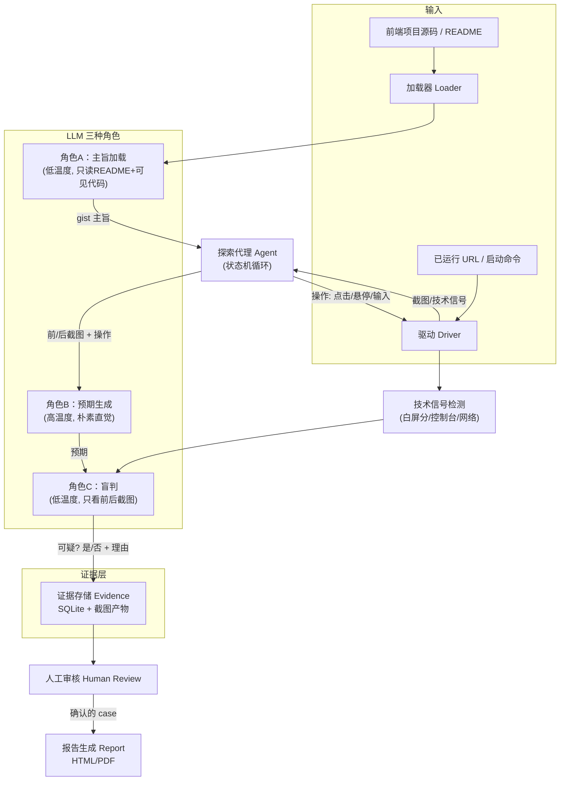

# AlienQA —— 前端测试软件 Planbook

> 让一个"没有经过教育的内测用户"（裸 LLM）从外部上帝视角自动探索前端，用"俺寻思之力"盲判所见是否符合预期，产出疑似问题证据；由人类终审后，编排成测试报告。

---

## 1. 项目愿景与核心哲学

### 1.1 一句话愿景

用有读图能力的大模型扮演一名**零先验、零培训的普通用户**，自动加载项目主旨、驱动浏览器点击各个按钮、盲判"实际所见 vs 直觉预期"的差距，把不符预期的现象沉淀为证据列表；人类只做最后一道"确有此问题"的终审闸门。

### 1.2 三个关键概念

| 概念 | 含义 | 落地手段 |
|---|---|---|
| **俺寻思之力** | LLM 凭朴素直觉形成预期，而非依据人类写的用例/规格 | 预期由 LLM 自行生成，人类不提供测试用例 |
| **无认知钢印** | 不把人类团队对系统的"第一印象"注入 LLM | 判定 LLM 永远看不到源码/实现细节，只拿到"主旨大意"；预期与判定解耦 |
| **盲判** | 判定阶段只比较"我预期会发生什么" vs "实际发生了什么" | 只看前后截图 + 技术信号，不给产品找借口 |

### 1.3 要找的两类问题

1. **技术 bug**：点了某按钮意外白屏/不加载、该出现的 hover 阴影没出现、控制台报错、接口 4xx/5xx、元素错位、加载永远转圈等。
2. **业务逻辑不清晰**：不符合直觉的交互路径、误导性文案、缺少操作反馈、按钮语义与结果不一致等。

---

## 2. 目标与非目标

### 2.1 目标

- 输入一个前端项目（源码目录或已运行的 URL），自动产出**主旨大意**。
- 自动探索界面，对可交互元素逐个点击/悬停/输入。
- 每条交互产出"预期 vs 实际"的盲判结果，可疑项进入**证据列表**（含前后截图、操作序列、技术信号）。
- 提供**人工审核界面**：逐条确认/驳回证据，补充备注。
- 将人工确认的 case 编排成**测试报告**（HTML/PDF，含证据图与复现步骤）。

### 2.2 非目标（v1 不做）

- 不做精确的像素级回归对比（可后置）。
- 不做单元/接口测试、性能测试、安全扫描。
- 不追求"零误报"——误报由人工审核兜底。
- 不承诺全自动修复 bug（只报告）。

---

## 3. 总体架构



---

## 4. 核心技术工作流（灵魂）

### 4.1 六阶段流程

```text
Phase 0  项目摄入   : 扫描仓库 → 提取 README + 前端可见文件(排除 node_modules/dist/minified)
Phase 1  主旨生成   : 角色A 用 3~5 句话总结"这是干什么的、面向谁、核心功能"(不含实现细节)
Phase 2  启动观察   : 启动应用 → 截图首页 → 采集技术信号
Phase 3  探索交互   : 角色B 生成朴素预期 → 驱动执行操作 → 截图 → 采集信号
Phase 4  盲判入库   : 角色C 盲判"预期 vs 实际" → 可疑项写入 evidence
Phase 5  人工终审   : 逐条确认/驳回 → 选定确有此问题的 case
Phase 6  报告编排   : 按严重度/类别编排报告
```

### 4.2 探索循环伪代码

```python
gist = loader.summarize(repo_path)                    # 角色A: 主旨大意
page = driver.launch(url_or_command)                  # 启动
screenshot = driver.screenshot("initial")
signals   = driver.collect_signals()                  # console/network/blank

budget = StepBudget(max_steps=N, max_minutes=T)
seen   = set()

for _ in budget:
    before  = driver.screenshot("before")
    # 角色B: 朴素预期（可采样 2~3 次取并集，高温度）
    expectations = llm.expect(gist, before, history)

    action = llm.pick_action(gist, before, history)   # 下一步操作
    expected = llm.predict(action, before, history)   # 对本次操作的预期

    driver.execute(action)                            # click/hover/type
    driver.wait_for_settle()
    after   = driver.screenshot("after")
    signals = driver.collect_signals()

    # 角色C: 盲判（低温度）
    verdict = llm.judge(action, before, after, expected, signals)

    if verdict.is_suspect:
        evidence.store(Evidence(...))

    seen.add(action.signature)
    history.append(...)
    if budget.exhausted or coverage_enough(seen):
        break

review.run(evidence)                                  # Phase 5 人工终审
report.generate(review.confirmed())                   # Phase 6 报告
```

### 4.3 "无认知钢印"的三条硬约束

1. **源码只给"加载器/角色A"看，角色B/C 永远看不到源码**。角色B/C 只能拿到 `gist` 主旨 + 截图。
2. **gist 只含"主旨大意"**，刻意剔除实现细节、技术栈、类名/组件名，避免 LLM"顺着代码猜实现"。
3. **预期与判定解耦**：角色B（预期）与角色C（判定）使用不同上下文、不同温度，必要时用不同模型，降低自我确认偏差。

---

## 5. 技术选型

### 5.1 自动化驱动层（关键决策）

**决策：Playwright（Python）为主力驱动；pyautogui 作为可选插件。**

| 维度 | pyautogui | Playwright | 结论 |
|---|---|---|---|
| 定位方式 | 屏幕坐标/图像匹配，分辨率相关、脆弱 | 语义选择器 + 文本/角色，自动等待 | Playwright 胜 |
| hover 检测 | 需真实移动鼠标到坐标，难断言 | `hover()` 精确触发 CSS `:hover`，可断言 | Playwright 胜 |
| 白屏/报错检测 | 只能看截图 | 截图 + DOM + `console` 错误 + 网络失败事件 | Playwright 胜 |
| 跨浏览器/无头 | 不支持 | Chromium/Firefox/WebKit + headless | Playwright 胜 |
| 真实 OS 级输入 | ✅ 是 | ❌ 否（浏览器内合成事件） | pyautogui 胜 |
| 适用场景 | 原生/桌面/非浏览器 GUI | Web 前端（本项目主场景） | Playwright 胜 |

- 主路径用 Playwright：可稳定点击、悬停、输入，并捕获 `page.on("console")`、`page.on("requestfailed")`、`page.on("response")` 等技术信号。
- pyautogui 保留为插件，仅用于"真实 OS 输入"边界场景：系统级弹窗、跨应用拖拽、Electron 原生菜单等。
- 抽象层设计：`driver.BaseDriver` 接口（`launch / screenshot / click / hover / type / collect_signals`），`PlaywrightDriver` 与 `PyAutoGuiDriver` 各自实现，配置切换。

### 5.2 多模态 LLM 与 SDK

- **SDK 抽象**：LiteLLM，统一 OpenAI / Anthropic / Gemini / Qwen / GLM / 豆包 等接口，一个 `base_url + model` 即可切换。
- **候选模型**：GPT-4o/4.1、Claude 4.x、Gemini 2.5 Pro、Qwen-VL-Max、GLM-4.6V、豆包视觉。
- **国内可用性**：需考虑 API 可达性与合规，Qwen-VL / GLM / 豆包作为境内首选；境外模型作为可配置备选。
- **分角色配置**：

| 角色 | 温度 | 模型策略 | 说明 |
|---|---|---|---|
| A 主旨加载 | 低(0~0.2) | 便宜快速模型 | 只读 README + 可见代码，输出 3~5 句 |
| B 预期生成 | 高(0.7~1.0) | 中端模型，采样 2~3 次取并集 | 鼓励发散，产出"朴素直觉预期" |
| C 盲判 | 低(0~0.3) | 强视觉模型 | 需要精确读图对比前后差异 |

### 5.3 语言与运行时

- **Python 3.11+**：pyautogui、Playwright、LiteLLM、Pillow、Jinja2 生态成熟，开发效率高。
- 依赖管理：`pyproject.toml` + `uv`（或 pip）。

### 5.4 存储

- **SQLite**：存 run、evidence、review 元数据（索引/查询/状态流转）。
- **文件系统 `artifacts/`**：截图、HTML/DOM 快照、日志等大产物，数据库只存路径引用。
- 证据条目追加写、可重放（保存操作序列便于复现）。

### 5.5 报告

- **Jinja2 模板 → HTML**；再经 Playwright `page.pdf()` 导出 PDF。
- 报告含：证据图并排对比（before/after）、复现步骤、严重度、类别、审核备注。

### 5.6 辅助图像处理

- **Pillow**：白屏检测（像素方差低于阈值 → 疑似白屏），可作为"第二双眼睛"给盲判提供客观信号，减少 LLM 漏判/误判。
- 可选升级：`scikit-image` 做元素缺失的结构相似度（SSIM）对比。

### 5.7 编排

- **v1 用手写状态机循环**：依赖轻、可调试、预算可控。
- 可选升级：LangGraph，用于更复杂的探索策略（回退、分支、目标导向探索）。

### 5.8 选型总表

| 组件 | 选型 | 备选 |
|---|---|---|
| 语言 | Python 3.11+ | — |
| 主力驱动 | Playwright (Python) | Selenium（不推荐，API 较老） |
| 补充驱动 | pyautogui | — |
| LLM SDK | LiteLLM | 各厂商原生 SDK |
| 视觉模型 | Qwen-VL-Max / GLM-4.6V / GPT-4o / Claude（可插拔） | 豆包视觉、Gemini |
| 存储 | SQLite + 文件系统 | JSON Lines（原型期） |
| 报告 | Jinja2 + HTML + Playwright PDF | WeasyPrint、Markdown |
| 配置 | pydantic-settings + YAML | — |
| 图像辅助 | Pillow（白屏/SSIM） | scikit-image |
| 编排 | 手写状态机 | LangGraph |

---

## 6. 目录结构

```text
AlienQA/
├── README.md                   # 项目门面
├── .gitignore
├── pyproject.toml
├── docs/                       # 工程文档（仅放文档）
│   ├── PLANBOOK.md             # 总体 planbook（愿景/技术选型/架构）
│   ├── planbooks/              # 13 个模块 planbook + 总索引
│   │   ├── README.md           # 总 planbook（索引与模块关联）
│   │   └── 01..13-*.md         # 各模块 planbook
│   └── engineering/
│       ├── governance.md       # Git 软件工程治理
│       └── commercialization.md# 付费接口预留设计
├── config/
│   └── config.yaml             # 模型、驱动、预算、探索策略、商业开关
├── alienqa/
│   ├── __init__.py
│   ├── main.py                 # CLI 入口（含权益检查钩子）
│   ├── loader/                 # 项目加载：README + 可见前端提取
│   ├── driver/                 # BaseDriver / PlaywrightDriver / PyAutoGuiDriver
│   ├── llm/                    # LiteLLM 封装 + 三角色 prompt
│   ├── agent/                  # 探索循环 / 状态机 / 预算
│   ├── judge/                  # 盲判编排 + 技术信号检测
│   ├── evidence/               # 证据存储（SQLite DAO）
│   ├── review/                 # 人工审核（Web UI / CLI）
│   ├── report/                 # 报告生成（Jinja2 → HTML/PDF）
│   ├── licensing/              # 商业化预留：LicenseProvider/Entitlement/用量计量（默认空实现）
│   └── utils/                  # 图像工具、日志、白屏检测
├── artifacts/                  # 运行产物（截图/快照/日志）
├── evidence.db                 # SQLite
├── reports/                    # 输出报告
└── tests/                      # 自测
```

---

## 7. 数据模型（Evidence Schema）

```json
{
  "id": "EV-0001",
  "run_id": "RUN-20260913-001",
  "timestamp": "2026-09-13T10:00:00Z",
  "page": "/login",
  "action": { "type": "click", "selector": "#submit", "label": "登录按钮" },
  "before_screenshot": "artifacts/run_1/ev_0001_before.png",
  "after_screenshot":  "artifacts/run_1/ev_0001_after.png",
  "expected": "点击登录应进入首页，或至少提示用户名/密码错误",
  "actual": "页面变白屏，无任何加载或错误提示",
  "verdict": "SUSPECT",
  "severity": "high",
  "category": "technical_bug",
  "technical_signals": {
    "console_errors": ["Uncaught TypeError: ..."],
    "network_failures": ["POST /api/login 500"],
    "blank_screen_score": 0.98
  },
  "llm_reasoning": "执行前后页面内容完全消失，且伴随 500 错误，疑似崩溃",
  "review": {
    "status": "pending",          // pending | confirmed | rejected
    "reviewer_note": "",
    "reviewed_at": null
  }
}
```

- `category` 枚举：`technical_bug`（技术 bug）、`unclear_logic`（业务逻辑不清晰）、`missing_feedback`（缺少反馈）、`misleading_copy`（误导文案）、`other`。
- `severity` 枚举：`high` / `medium` / `low`。
- `review.status` 流转：`pending → confirmed | rejected`（可回退）。

---

## 8. 提示词设计（灵魂）

### 8.1 角色 A：主旨加载（低温度）

> 你是产品观察员。请阅读以下 README 和前端页面结构，用 3~5 句话总结：这个应用是做什么的、面向谁、核心功能有哪些。**只总结主旨，不要推断实现细节、技术栈或代码结构。**

要点：输出仅 `gist` 文本；刻意要求"不推断实现"，为后续"无钢印"铺路。

### 8.2 角色 B：预期生成（高温度，采样取并集）

> 你是一名**第一次打开这个产品、从未受过任何培训的普通用户**。你只看到产品简介和当前界面截图。
> 请用最朴素的直觉，列出：1) 这个界面有哪些功能；2) 界面上每个可见按钮/输入框/链接，你**自然而然**会预期它点了之后发生什么；3) 哪些地方让你觉得"好像少了点什么"。
> 不要猜测实现技术，不要为产品找解释，就按一个普通人的直觉说。

要点：
- 强调"普通人直觉"，这是"俺寻思之力"的来源。
- 采样 2~3 次取并集，得到更发散的预期集合。

### 8.3 角色 C：盲判（低温度）

> 你刚刚对界面执行了操作：{action 描述}。
> 执行前界面见[图A]，执行后界面见[图B]。
> 作为一个普通用户，你原本预期会发生：{expected}。
> 请盲判：实际结果是否符合预期？
> 如果不符合，指出具体哪里不对劲、有多严重（high/medium/low）、属于哪类问题（技术故障 / 业务逻辑不清晰 / 缺少反馈 / 误导文案 / 其他）。
> **只看图，不要为产品找借口。**

要点：
- 判定输入只含 `action + before + after + expected + 技术信号`，**不含源码**。
- 技术信号（控制台错误、网络失败、白屏分）作为客观旁证注入，帮助 LLM 不被截图表象迷惑，也防止漏判。

---

## 9. 人工审核界面（Phase 5）

- 逐条展示证据：并排 before/after 截图、操作描述、预期 vs 实际、严重度、类别、LLM 理由、技术信号。
- 操作：**确认**（确有此问题）、**驳回**（误报/可接受）、**编辑**（改严重度/类别/备注）。
- 筛选：按 `status / severity / category / page` 过滤；批量操作。
- 实现：v1 用轻量 Web UI（如 Streamlit 或 Flask + 静态页），后续可做成 VS Code 扩展面板。

---

## 10. 报告机制（Phase 6）

- 只收录 `review.status == "confirmed"` 的 case。
- 结构：
  1. 概览：总探索步数、交互元素数、确认问题数、按严重度/类别分布（可配图表）。
  2. 问题清单：每条含证据图并排、复现步骤、预期/实际、严重度、类别、审核备注。
  3. 附则：被驳回的疑似项（可选附录，供团队了解 LLM 判断边界）。
- 输出：`reports/<run_id>.html` 与 `.pdf`。

---

## 11. 里程碑与任务拆解

| 里程碑 | 内容 | 预估 |
|---|---|---|
| M0 | 骨架 + 配置 + LiteLLM 客户端 + 三角色 prompt + 商业化占位接口 | 0.5 天 |
| M1 | Loader：README + 可见前端提取 + 主旨生成 | 1 天 |
| M2 | Playwright 驱动 + 截图 + 技术信号采集（console/network/白屏分） | 1.5 天 |
| M3 | 探索循环 + 预期生成 + 盲判 + 证据入库 | 2 天 |
| M4 | 人工审核界面 | 1.5 天 |
| M5 | 报告生成（HTML/PDF） | 1 天 |
| M6 | 端到端联调 + 真实项目试点 + 提示词打磨 | 2 天 |

合计约 **9~10 个工作日**（单开发者）。

---

## 12. 风险与对策

| 风险 | 对策 |
|---|---|
| LLM 预期过于发散或过于保守 | 高温度采样取并集 + 技术信号兜底 + 人工终审兜底 |
| 误报率高 | 人工审核是第二道闸；分级 severity；驳回项归档 |
| 探索卡在登录/权限 | 支持预置登录态、种子操作、跳过认证配置 |
| 无限循环探索 | 步数/时间预算 + 操作去重 + 覆盖率上限 |
| pyautogui 坐标脆弱 | 首选 Playwright；pyautogui 仅边界场景 |
| 截图分辨率影响判读 | 统一视口与截图尺寸；可压缩/裁剪降成本 |
| API 成本 | 分角色用不同档位模型、限制截图大小、按步骤记账 |
| 隐私/数据安全 | 截图本地留存、支持本地模型、敏感信息脱敏 |
| 网络不可达（境外模型） | LiteLLM 可插拔，境内模型（Qwen-VL/GLM/豆包）可切换 |

---

## 13. 验收标准

1. 输入一个前端项目，能自动产出**主旨大意**。
2. 能自动探索界面，对可交互元素执行点击/悬停/输入，并产出 N 条证据（含前后截图对比）。
3. 对**已知注入的 bug**（白屏、hover 缺失、控制台报错）能稳定命中为 `SUSPECT`。
4. 人工审核界面能逐条确认/驳回/备注，状态正确流转。
5. 能生成含证据图与复现步骤的 HTML/PDF 报告。
6. 试点项目跑通后，团队能据此**复现并定位**报告中的问题。

---

## 14. 商业化预留（付费接口占位）

> 现在不设计具体怎么付费，只预留扩展点；详见 `docs/engineering/commercialization.md`。

- **原则**：核心测试逻辑与商业能力解耦；默认 `commercial.enabled = false`，不影响自用。
- **预留接口**：`licensing/` 模块（`LicenseProvider` / `Entitlement` / `FeatureGate`，默认 `NullLicenseProvider` 放行）、入口 `check_entitlement()` 钩子、报告页脚水印钩子、用量计量埋点（只计数不收费）。
- **配置**：`config.yaml` 增加 `commercial` 段。
- **"以后再做"清单**：定价、支付通道、账户系统、激活服务器、防破解。
