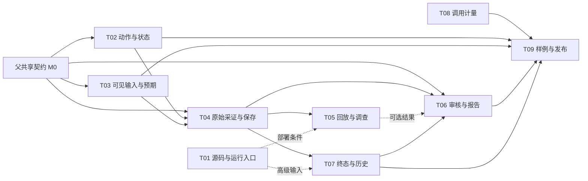

# AlienQA MVP 技术实施 Planbook 索引

版本：2026-10-02-tech-12。状态：T01 F01～F07/F09 已统一应用基准、运行入口、字面量路由、静态产物/部署与本机兼容证据，F08 后置；T04、T03 N01～N05、T06 H01～H08 与 T08 K01～K05 工程范围已接通；T02 的主页面交互、状态、尝试轨迹与锁版本框架机制路径已实现，frame/shadow 首版只检测并说明覆盖；T05 E01～E07 的回放窗口、具体事实匹配、保守分组、调查范围和终态增量已接通；T07 U01～U06 与本机 U07 已完成共享输入、终态核对、历史和安装包完整路径验收；新增 Codex 登录接口与有界验收运行器。N03 校准 C01～C05 已实现，C06 已完成离线对照并执行版本化真实复跑；模型效果、独立人审、真实应用和发布验收分开关闭。见[T01 记录](../../t01-implementation.md)、[T07 记录](../../t07-implementation.md)、[T05 记录](../../t05-implementation.md)、[T02 记录](../../t02-implementation.md)、[T04 记录](../../t04-implementation.md)、[T03 记录](../../t03-implementation.md)、[T06 记录](../../t06-implementation.md)、[T08 记录](../../t08-implementation.md)、[N06 首轮结果](../../n06-first-results.md)、[N03 校准记录](../../n03-calibration-results.md)；其余节点仍按计划推进。
本目录是[四份功能子计划](../README.md)的实施分解：父计划定义用户结果和 J/R/L/V 承诺，技术节点定义修改哪个模块、如何交接及如何验证。
两者共用 M0～M3 顺序与共享契约；不是九个独立产品或另一套排期。本文不承诺人日、人员和未经测量的效果数字。

## 1. 技术维度与模块所有权

| 节点 / 任务 | 应改进的代码模块 | 主要输出 | 父任务 |
|---|---|---|---|
| [T01 项目与框架兼容](01-project-framework-compatibility.md)，F01～F09 | loader/framework/scan/models/entry_detector；CLI/UI prepare | 选中应用、真实 cwd/URL、路由提示、静态/服务型产物与兼容矩阵 | L01/L02/L04，V01/V03/V04 |
| [T02 浏览器交互与状态](02-browser-interaction-state.md)，B01～B09 | driver/action/playwright_driver；state；planner | 稳定定位、受控表单、自定义控件、异步窗口、状态与完整尝试 | J01/J04/J05，L02～L05，V01/V03/V04 |
| [T03 上下文与认知判定](03-context-expectation-judgment.md)，N01～N06 | context；mapper 输入边界；expectation；llm/roles | 事前可见输入、basis、可见历史、可追溯四态判定 | J01～J06，R01 |
| [T04 运行管线与持久化](04-runtime-pipeline-persistence.md)，P01～P07 | driver/runtime；observation；pipeline；evidence；storage；RunManager | 先保存的原始窗口、独立技术候选、增量认知证据与有效前缀 | R01/R02，L03/L04 |
| [T05 回放、聚类与调查](05-replay-dedup-investigation.md)，E01～E07 | replay；dedup；investigation；结果接线 | 可恢复条件、再现依据、保留全部成员的 Issue、根因假设 | R02/R05/R06，L03～L05，V01/V03 |
| [T06 审核、报告与产物](06-review-report-artifacts.md)，H01～H08 | review；UI/独立审核模板；报告路由 | 四种决定+备注、analysis/confirmed、终态快照和离线 HTML | R03～R06 |
| [T07 本地运行与生命周期](07-local-run-ui-lifecycle.md)，U01～U07 | CLI；ui/app/jobs/runs/settings/templates | URL 主入口、校验、停止/终态、历史、报告入口与安装使用路径 | L01～L05，R03/R06，V04/V05 |
| [T08 LLM 适配与计量](08-llm-execution-metering.md)，K01～K06 | llm/client/models/config/roles；角色调用点；计量 helper | 所有 attempt、实际配置、解析状态、用量和未知费用 | J05，L02～L04，V02/V03 |
| [T09 样例、兼容与发布](09-fixtures-compatibility-release.md)，Q01～Q07 | tests/fixtures/runner；pyproject/MANIFEST/lock；CI；发布说明 | 配对样例、真实机制/模型记录、发行安装与证据矩阵 | J/R/L 联合验收，V01～V05 |

表中的模块所有权是职责边界；实际开发分工可以调整。共享文件按接口分开：T02 定义动作事实，T04 保存事实，T07 控制进程与入口，T06 消费审核快照。
T03 定义 basis，T04 序列化，T06 显示；T08 在实际请求边界计量，T09 消费记录做评估，不另写一套计量系统。

T03 的专项副计划：[N03 采样合并校准](03a-sampling-merge-calibration.md)，C01～C06。C01～C05 的同义/缺席/冲突/未知关系、合并来源与版本、部分检查状态和报告展示已实现；C06 结果及开放 gate 见 [校准记录](../../n03-calibration-results.md)。属于 N03 的实施增量，不新增技术主节点。

## 2. 框架兼容应拆到哪些具体层

| 层次 | 核心问题 | 具体任务 / 证据 |
|---|---|---|
| 源码识别与应用选择 | devDependencies、组件库误报、workspace、多个前端、选中子应用 cwd | F01/F02；合成 manifest 回归不能代替框架运行 |
| 脚本与运行入口 | packageManager/锁文件、脚本正文、实际端口、已有 URL | F03/U01/U02；显式启动命令和已运行服务，无默认自动安装 |
| 路由与源码表面 | React/Vue 字面量路由，Next app/pages/src、动态模板与路由组 | F04/F05；模板不是已访问地址，无法解析的表达式明确列限制 |
| 构建产物与部署 | dist/build/out 对比 .next/SSR；history fallback、hash、子路径 | F06/F07/E02；资源缺失仍应真实报错，不能用 HTML 200 掩盖 |
| 浏览器控件 | React/Vue 受控输入、blur/change、自定义 select、portal、重渲染 | B01～B03/B05；真实 DOM 动作和状态，不依赖框架私有 store |
| 页面生命周期 | SPA 客户端导航、SSR/hydration、异步反馈、轮询/加载 | B04/P01/P02；有界观察与阶段结果，不用固定 sleep 冒充业务完成 |
| 登录态与回放 | cookies/localStorage、初始条件、成功前缀、新上下文 | B06/B07/E01～E03；sessionStorage 等未支持项单列 |
| 复杂作用域与扩展 | frame/shadow、Nuxt/SvelteKit/Angular、复杂组件库 | B08/F08；MVP 先说明覆盖限制，支持增量由真实需求和样例决定 |

MVP 优先补通用 DOM 机制和 React/Vite、Vue/Vite、Next App/Pages 的小型样例；不建设每个框架的专用测试插件。
URL-first 意味着源码识别失败不阻断已运行页面扫描；SSR 也不能被误归为“必须静态服务”的不支持应用。
三个最小样例用于逐项兼容证据；父 V03 仍要求至少一款真实小应用基线，不要求所有框架/构建/版本组合齐备才拿到首份分析。
具体框架目录规则在实施时按锁定版本复核官方资料；T01 的字面量结构与真实框架/部署证据见实施记录；未实跑组合仍列未验证。

## 3. 依赖图与运行时顺序

图表示供应依赖，不表示必须串行开发。T01 是源码/本机服务路径的增强，不是 URL 主路径的前置；调查和 reporter 成功也不是 analysis 前置。

运行时顺序必须单独遵守：

1. 启动/进入页面，先提交入口 runtime 和技术候选，再调用地图模型。
2. 当前状态选动作，冻结允许输入并尝试形成事前预期；失败明确记录，可继续技术 QA。
3. 执行动作，立即提交原始步骤/runtime/技术候选；随后增量保存可获得的截图/可见结果。
4. 调用视觉和认知判定，增量保存认知证据；已发生结果只能供下一步的可见历史。
5. 任务退出并确认清理，读取 committed 前缀；回放/调查为增量，审核和报告消费同一有效终态快照。

接口集中点：[父字段契约](../README.md#4-共享契约只做必要的增量)、[T04 提交与版本](04-runtime-pipeline-persistence.md#2-共享输入输出与提交点)、[T06 双模式](06-review-report-artifacts.md#h03reportbuilder-增加显式双模式)、[T07 终态](07-local-run-ui-lifecycle.md#2-共享读写与终态)、[T08 attempt](08-llm-execution-metering.md#2-最小调用记录契约)。
保留原 Evidence/SQLite/JSON，新增字段可缺省；不新增第二套 Finding DB、分布式版本/队列或企业审计。

## 4. 建议实施批次

| 批次 | 具体工程包 | 关闭证据 |
|---|---|---|
| M0 契约 | Target/执行阶段；basis；raw/checkpoint；报告 mode；attempt 上下文 | 本目录和父契约一致；实施前用接口样例固定最小布局 |
| M1-A 原始链路 | B01/B02/B04/B06；P01/P02/P03/P05/P06；U02/U03/U04；K01/K03/K05 | 模型阻塞后停止，入口/动作技术异常及全部尝试仍可读取 |
| M1-B 认知与分析 | N01/N02/N03/N05；P04/P07；E01/E04/E05；H01～H07 最小接线；U01/U05/U06；K02/K04 | URL 到双来源证据、四种决定/备注、带 pending 的 analysis |
| M1 并行准备 | Q01/Q02/Q03；F01～F06 的源码增强；B03/B05/B07、N04、报告离线验收准备 | 有固定正常/异常和合理例外；源码增强不拖住 URL 闭环 |
| M2 可用性 | 完成 B/N/P/E/H/U/K 的 MVP 项；F07/F09；Q02/Q03/Q04；Q05/Q06 准备 | 真实小机制/一款真实应用、独立回放、人审基线与调用账目 |
| M3 发布 | Q05～Q07、U07/H08；支持范围、安装、旧数据和 HTML 留存 | 发行包在独立空目录跑完整路径（本项目外部样例和运行产物仍仅放项目内并 gitignore），版本/命令/限制均有证据 |
| 后置 | F08、B08 的额外支持、复杂路由广覆盖、PDF/团队功能 | 依据试用反馈独立立项，不自动变为当前 release gate |

批次可交叠：例如 H01/H02 和 N01 可先做，真实模型在闭环可用后尽早采样；M1-A 的原始保存必须先于该步模型解释运行。
首次执行优先完成 P/U 的保存和终态接线、N 的输入依据、H 的完整分析，再扩大框架支持面。不能只完成 loader 分支却缺审核交付。

T06 已完成审核与离线交付，T08 已补齐请求、用量和未知费用记录。首轮 N06 暴露的同义措辞合并瓶颈已按 [N03 副计划](03a-sampling-merge-calibration.md)完成工程校准；有限词形不足以稳定覆盖的真实证据促使生成提示独立升为 general-user-v2，仅规范自主选择的普通反馈要求，judge 为 judgment-v2。本轮 98 次调用，新提示核心配对 4/4、合理校验 1/1 可用，旧未决保留。下一阶段依据 [C06 结果](../../n03-calibration-results.md)完成独立复核和新提示前序一致性复跑，再接项目内 Linkding 等真实小应用，联动 N06/K06/Q04；T02 已补齐主页面定位、受控表单、动态控件、有界观察、状态及尝试/回放身份，并完成锁版本 React/Vue/Next 工程机制路径；支持范围与 Next shadow 未验证区域见 [T02 记录](../../t02-implementation.md)。T05 已完成回放前提与独立目标窗口、具体事实匹配、保守分组及有界调查，新增四条真实框架异常回放路径，见 [实施记录](../../t05-implementation.md)。T07 已完成共享输入、选中目录、终态核对、历史统计、独立审核重开和本机安装包完整路径，649 项回归通过、覆盖率 87.82%，见 [T07 记录](../../t07-implementation.md)。T01 已完成 F01～F07/F09 的功能 MVP，完整套件 693 项及 23 项定向补充通过（去重 694），合并覆盖率 88.30%，最终包与本机安装验收通过；所选应用、启动 cwd、源码表面、运行入口和回放部署条件统一，F08 后置，见 [T01 记录](../../t01-implementation.md)。下一份工程主节点为 **T09**：优先 Q01/Q02/Q03 整理并固定既有验收资产，Q05 补全新环境安装；Q04 联动 N06/K06 的独立复核与真实小应用。跨平台发布、真实模型/人审与有效性 gate 继续分开关闭。

## 5. 父任务到技术任务的覆盖

| 父任务 | 技术实施 / 联合验收 |
|---|---|
| J01 | N01/N03，B01/B02，Q03 |
| J02 | N01，U01，P04 范围降级，Q03 |
| J03 | N02/N03，P05，H04，Q01/Q03/Q04 |
| J04 | N04，B05/B06，P02，Q03 |
| J05 | N05，P04，K01/K02，Q03 |
| J06 | N06，Q01/Q03/Q04 |
| R01 | N02/N05，P05，H04，Q03 |
| R02 | P01～P04，E04/E05，Q01/Q03 |
| R03 | H01/H02/H06，U05，Q03 |
| R04 | H03/H04/H07，E04，U05/U06，Q03 |
| R05 | P06，E05，H05/H06，U03，Q03 |
| R06 | E01～E03/E06/E07，H02/H04/H07/H08，U05，Q03/Q05 |
| L01 | U01/U05/U06，H07，Q05 |
| L02 | U02，F01～F06，B04/B07，K03，Q02 |
| L03 | P02/P04/P06，B06，U03/U04，K05，Q03 |
| L04 | P05/P06，B06/B07，E01/E02/E05/E06，U04/U06，K04，Q03 |
| L05 | U07，E07，H07/H08，Q03/Q05 |
| V01 | Q01/Q02/Q03，B09，F09，N06，E07 |
| V02 | K01～K06，Q04 |
| V03 | Q04，N06，K06；F09/B09 提供已验证机制与限制 |
| V04 | Q05/Q06，U07，H08，F09 |
| V05 | Q06/Q07，U07 |

每项关闭要有代码/输入输出、对应模块回归和联合路径证据；引用父任务或补文档不等于完成实现。

## 6. 原 13 模块如何消费本目录

| 原模块 | 当前增量入口 |
|---|---|
| 01 Project Loader（含 01b） | T01；T07 输入与实际 URL |
| 02 Product Mapper（含 02b） | T03 输入边界；T04 入口先采证/地图失败降级 |
| 03 Exploration Context | T03 可见输入与历史 |
| 04 Browser Controller | T02；T04 原始监听 |
| 05 State Tracker / 06 Action Planner | T02 状态、候选与全部尝试；T03 允许上下文 |
| 07 Observation Engine | T04 runtime/视觉拆分；T02 有界观察 |
| 08 Expectation Engine | T03 basis/判定；T08 调用记录 |
| 09 Evidence Engine | T04 双来源/存储；T05 回放条件 |
| 10 Deduplicator / 11 Investigation（含 11b） | T05；T04 已提交证据与可选增量 |
| 12 Human Review + Report | T06；T07 主入口；T08 可选 reporter 计量 |
| 13 Replay Engine | T05；T01 部署；T02 动作/状态/登录态 |
| 横向 Python 包、测试、CI 与本机 UI | T07/T08/T09 |

旧模块文档中的长期愿景与早期依赖不能覆盖本轮 URL-first、独立技术候选、事前预期和 analysis 交付契约。
历史 302 项/85.88% 和构建通过只证明上一轮链路；T04/T03/T06/T08 的新增验证分别记录。analysis、离线闭环与请求账目已做工程回归；已有本机核心框架、部署和安装证据见 T01/T02/T07 记录；跨平台/新依赖环境、模型效果、真实供应商费用格式和真实应用仍待验收。
