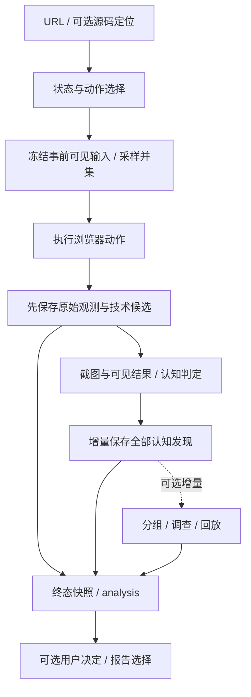

# AlienQA 当前项目状况与下一阶段重点

评估日期：2026-10-02。范围：当前工作区代码、工程计划、验证记录与运行账目；包含尚未提交的 N03 v4 改动及随后三款开源应用测试增量。本文区分代码能力、历史验证和分析推断，不将旧 CI 或旧模型结果归给新版本。应用运行事实与复测门槛见[开源应用记录](open-source-applications.md)。

> 后续增量：[弹层与观察修复](popup-exploration-fix.md)已完成。默认回归更新为 817 项/88.11%，另 24 条框架路径通过；Memos 能进入菜单并走到保存，TodoMVC 和修复后的 IT-Tools 四步完成。原批累计 181/200；两条主观发现与未知要求保留。下文阶段盘点保留当时状态，最新事实以该实施记录为准。

## 1. 总体定性

**AlienQA 已形成可以真实使用和验证的实验性功能 MVP，工程闭环较完整，产品定位刚完成关键校正；下一阶段的主要瓶颈是探索覆盖与发现的交付质量。**

它已经可以从应用 URL 出发，执行浏览器动作，形成事前预期，保存技术异常和认知落差，记录调用，支持回放与用户决定，交付离线 HTML。现在继续用“还缺哪个模块”描述推进顺序，已经不够准确：九份技术计划的主要工程链路已接通，剩余任务跨越探索、输入、判定和报告。

产品效果证据仍很窄。历史模型运行覆盖了控制样例、两步历史和固定 TodoMVC；最新并集契约已有 TodoMVC、IT-Tools、Memos 各自主/定向四步的六次真实扫描。它们验证了有限路径和候选保留，也暴露了菜单交互、输入选择和观察缺口。可以称为实验性本机工具，尚无依据宣称具有成熟的自动探索能力、广泛的用户认知发现效果或增长收益。

## 2. 产品定位已经清楚，部分实现语言仍需跟上

价值主张是：**帮你发现产品里那些只有内部人才觉得理所当然的地方。** 使用者先聚焦独立开发者；模拟对象是懂相关行业、首次使用产品的外部用户。

“俺寻思之力”对应的是允许模型提出主观预期、保留它感受到的落差，再把选择权交给产品使用者。团队内部答案不能作为过滤依据。“按设计”也不消除认知落差：它可能恰好揭示用户不知道的前提。

当前 `general-user-v4 / sampling-merge-v3 / judgment-v3` 契约已经落实两次采样取并集，一次提出即可进入检查。关系未知或互斥只作为备注，确定等价的重复项去重但保留来源。落差与无法判断项可以同时保存。工程验收优先关注探索、候选处理和交付是否丢失，不要求独立人审，不控制误报率或接受率。

保留引用校验、步骤身份校验和原始观测是必要的：它们保证报告没有引用不存在的预期、串错动作或丢掉记录，而不是审核模型的认知是否“合理”。该边界见[N03 当前契约](n03-generation-contract.md)与[MVP 共享契约](mvp-planbooks/README.md)。

仍有少量旧语言和默认值：底层报告 API 默认 confirmed，部分 CLI 提示沿用人工审核措辞，证据分类可能直接叫 `technical_bug`。这些不会自动否决 analysis 的全部发现，但容易让用户误以为工具已经裁定了正确答案。后续应统一展示口径，并保留旧数据读取兼容。

## 3. 工程能力盘点

| 能力 | 当前实现 | 证据边界 / 主要缺口 |
|---|---|---|
| 输入与框架（T01） | URL 优先；源码辅助、子应用选择、静态产物、字面量路由、显式启动命令 | 固定 React/Vue/Next 与部署路径有机制证据；不等于全部变体兼容 |
| 交互与状态（T02） | 主页面定位、受控表单、动态控件、有界异步观察、尝试轨迹、Enter 探索 | 主要依据 DOM 候选与规则选动作；复杂 frame/shadow 主要检测并说明限制 |
| 上下文与认知（T03） | 可见输入隔离、事前冻结、近期历史、预期来源与身份；并集及局部落差保留 | v4 三应用扫描保留全部来源；无文案目标描述、条件要求和输入截断限制判断 |
| 采证与持久化（T04） | 原始信号先保存、技术候选独立于模型、增量提交、失败/停止恢复前缀 | 能解释本次处理到哪里，不能由此保证探索到了全部问题 |
| 回放与调查（T05） | 独立上下文、前提恢复、特定事实匹配、保留成员的分组、有界调查 | 外部服务、数据与会话仍可能变化；根因是后续假设，回放不决定用户是否采信 |
| 报告（T06） | 全部发现的 analysis、可选决定与备注、主动筛选的 confirmed、离线截图 | 核心交付已接通；展示语言和长报告阅读体验需要实际使用检验 |
| 本机运行（T07） | CLI/UI 共享输入、生命周期、停止、历史、重开结果及安装流程 | 本机闭环可用；平台和当前源码版本的安装证据要分开看 |
| 模型与计量（T08） | 六角色、API 与既有 Codex 登录适配、attempt、实际配置、未知用量保留 | 实际金额和供应商内部请求数可能未知；没有通用费用硬上限 |
| 验证与发行（T09） | 控制/历史样例、模型运行器、固定三应用与重置配方、分层摘要、wheel/sdist 验收 | v4 有界真实应用基线已完成；控制复跑、更广流程及当前源码 CI/新依赖安装仍开放 |

模块详情与未关闭项以[技术计划索引](mvp-planbooks/technical/README.md)及各实施记录为准。“主要链路已接通”不等于每个长期任务或后置兼容项都已完成。

当前架构的关键特征是两类发现共享持久化和交付，而技术采证不依赖认知模型成功：

这是设计上的事实溯源，不意味着一次失败扫描会强行经过所有阶段。错误、停止或超时按已提交的前缀交付，并说明缺失阶段。

## 4. 验证结果应当怎样理解

| 验证层 | 已有结果 | 可以推出什么 |
|---|---|---|
| 当前 v4 工程回归 | 应用测试增量后完整与补充重测按最新结果去重 801 项通过；完整套件覆盖率 88.10%；替身回归不调用模型 | 已覆盖的程序机制与并集/保留契约成立；不是模型效果分数 |
| 已保存采样的离线重合并 | 首组有候选步骤 4/5 → 5/5；生成边界组 2/5 → 4/5，余一项原采样为空 | 新规则不再因关系问题阻断这些合法要求；没有生成新预期或新 Evidence |
| 历史浏览器/安装 | 24 条固定框架路径、TodoMVC 独立回放、wheel/sdist 两套新依赖完整路径通过 | 对应锁定版本的交互与安装机制有证据；不能扩大为所有框架和平台 |
| 历史远程 CI | 源码 `76842e8` 的 Ubuntu Python 3.11/3.13 默认回归及 3.11 干净安装成功；可选框架 job 跳过 | 该源码版本有远程工程证据；不覆盖当前未提交 v4 |
| 历史真实模型新批 | 三阶段共 98 次 CLI 启动、12 run / 21 步；覆盖控制样例、历史与固定 TodoMVC | 少量真实调用与路径已跑通；版本不同，不能用于证明当前 v4 效果 |
| 当前 v4 模型/应用 | 三应用六次四步扫描；105/200 调用成功且对齐；97 个来源保留、81 条要求、13 条未知；零 Evidence | 有限路径的真实执行与候选保留；1 动作被弹层阻挡；不证明全站零问题 |

上述工程数字引用[N03 记录](n03-generation-contract.md)，历史 CI 和机制范围引用[兼容与发布记录](compatibility-and-release.md)。本次文档和许可证整理另做发行构建检查，不重复计为真实模型或干净安装验收。

历史异常控制样例每次产出技术异常与缺反馈两条发现，共重复两次；这是同一个注入故障的重复观测，不能说发现了四个独立缺陷。历史 v3 的 TodoMVC Enter 采样为空；当前 v4 已生成 Enter 要求，但仍包含未执行的空输入条件，保留为未知。当前版本的异常/例外控制样例尚未复跑。

计量账目能对齐全部六角色：历史 98/100 批已返回 prompt_tokens=808932、completion_tokens=12131，余 2 次；三应用另开 200 上限，使用 105 次，已返回 prompt_tokens=970660、completion_tokens=13356，余 95 次。total_tokens、金额、币种与供应商内部 HTTP 请求数仍未知，不能将订阅通道写成零成本。零 Evidence 的应用批没有触发调查和 reporter，不由此推导它们的真实交付效果。

旧人审材料保留为可选用户反馈资产，不再是待通过的验收项。也不从用户采信与否倒推工具生成的认知落差是否应当被删除。

## 5. 真正影响价值兑现的缺口

以下由当前代码结构推断潜在漏报来源，尚无广泛真实应用样本可给出漏报率。

### 5.1 探索决定了能发现什么

[Planner](../../alienqa/planner/planner.py) 主要从 DOM 候选、表单准备和动作评分中选择操作，使用固定示例值，并跳过 disabled、readonly、hidden、file 等输入。它具备若干实用交互机制，但尚未形成通用的多步骤业务任务探索。

未到达的页面、未形成的业务状态、无法操作的控件，都可能让认知预期无从生成。尤其禁用控件为什么不可用、产品默认流程为何令人困惑，未必需要一次成功点击才值得讨论。增加更多采样只能扩大已选动作的预期，不能弥补没有访问到的状态。

### 5.2 可见输入的覆盖仍有限

[预期输入](../../alienqa/expectation/engine.py) 当前是文字与控件描述：可见文本最多 4000 字符，最多 40 个元素且每项 100 字符，历史只取最近 5 步、每步结果最多 1000 字符。事前生成没有直接消费页面截图；截图用于后续观察与判定。

因此纯视觉暗示、长页面尾部信息、远距离步骤历史可能没有进入事前预期。代码记录了截断，这有利于解释缺口，但不会自动补足它。应根据真实漏探索样例改进输入选择或视觉入口，继续保持事前信息与事后结果隔离。

### 5.3 “懂行业”目前主要依赖模型已有知识

当前能力来自提示词和模型已有知识，没有独立行业知识检索或行业背景验证链路。这足以作为功能 MVP 的起点，但不能承诺稳定、最新或穷尽的行业理解。

后续可以支持简短的外部领域背景，而无需先做岗位画像系统；必须避免把待测产品内部答案伪装成行业常识。这属于输入能力的改进，不是设置“专业程度达标后才保留发现”的门槛。

### 5.4 证据已保留，解释语言仍可能过度确定

[证据规则](../../alienqa/evidence/severity.py) 的 `confidence` 是技术信号加分的启发式值，不是经过校准的真实性概率。分类也可能把 4xx 等观测归到 `technical_bug`。它们有助组织报告，却不应让读者把模型意见和已观测的技术事实理解成相同层次的结论。

应明确呈现“预期是什么、实际看到什么、差异为什么让该外部用户在意、还有什么未处理”。不必为了控制误报而过滤内容，也不应给内部答案一个隐蔽的裁判入口。

### 5.5 调用账目完整，不代表成本可预测

可选调查在产生发现后增加调用和等待；报告正文可以在 reporter 失败时保留，但较多发现仍可能带来长报告和高成本。当前成本归属和未知项已得到记录，真实业务中每条发现的调用、延迟与阅读负担还未形成稳定基线。

优化目标是更容易消费、调查可以按需启动、失败仍可交付，而不是为了减少报告数量删除单次提出的候选。工程计量完整性与“用户是否愿意阅读、是否获得启发”要分别观察。

## 6. 下一阶段推进顺序

1. **收束当前版本和用户入口。** 将许可、用户 README、开发指南与当前 v4 契约作为一致的版本收束；提交后取得当前源码 CI 与新发行安装证据。历史记录继续保留原版本。本次整理只完成文档与许可，不自动提交或推送。
2. **先修真实应用暴露的探索和输入缺口。** Memos 菜单打开后，单元范围未纳入弹层，planner 再点原按钮被阻挡；无文案目标被描述为“当前控件”，模型无法识别；JSON 输入只有固定字符串。优先增强 T02 弹层/输入与 T03 目标描述、作用域更新，以能继续操作菜单并保存、覆盖合法/非法转换分支为复测门槛，不删除原始失败分母。
3. **补 N05 可观察状态，再完成 v4 控制复跑。** Memos 焦点要求因为截图无可辨光标保留未知，应增加前后焦点事实。正常、异常、合理例外和两步历史在当前版本仍需单独复跑；沿用本批剩余授权或另获预算，所有失败、修复、fallback、调查和报告调用均入账。形成“未到达 → 输入缺失 → 未生成/无法判断 → 已产出但未保存/展示”的原因分层，不设人审、误报或采信率门槛。
4. **补输入覆盖和报告表达。** 用出现问题的具体页面验证文字截断、视觉暗示和长历史改进；统一旧审核措辞与启发式置信度表达，让全部发现更容易被理解。保持原始 Evidence，不用分组或摘要抹掉成员。
5. **扩大现有样例的流程，再增加应用。** 三款已固定和可重置的应用作为基线，先覆盖保存、编辑、删除、筛选等更长路径，再增加其他小应用；源码、依赖、数据与结果继续全部留在项目内忽略目录。用户反馈作为自愿的产品学习材料，不作为放行审批。

PDF、大规模框架扩张、岗位画像、团队服务暂不需要进入关键路径。现有闭环已经足够承载上述验证，下一轮应由真实缺口驱动修改，而不是继续按模块编号顺序补功能。

## 7. 本次整理的交付

- 加入 MIT 许可证，并声明发行包 SPDX 许可与许可文件；第三方依赖和示例保持自己的许可。
- 原 README 全文收至[工程归档](archive/2026-10-02-readme-before-user-guide.md)，加历史口径说明并修复相对链接。
- [用户 README](../../README.md) 改为价值主张、安装启动、模型配置、报告阅读和支持边界；[开发指南](developer-guide.md) 承接架构、工程命令和详细文档入口。
- 本文形成全局现状快照，后续更新要附新源码版本与新验证结果，不能把未来计划写成已完成能力。
