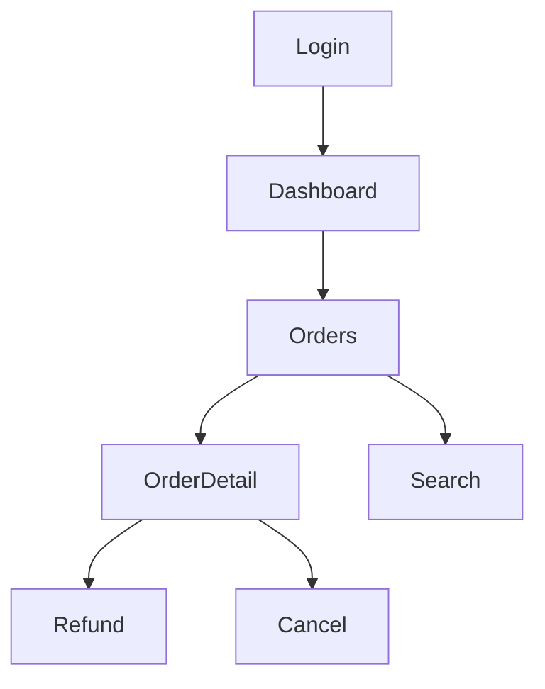

# 模块 05：State Tracker（状态追踪器）

> 整个系统的核心基础设施之一：负责知道"我刚才在哪里、去过哪里"，形成 **State Graph**。

---

## 1. 职责

- 维护 State 序列与 State Graph。
- 识别 `route / modal / toast` 等状态维度，判断"这是不是新状态"。
- 防重复：已探索状态不再重复点击，避免无限循环。

## 2. 输入

- 每次 Action 执行后的 `route`、DOM/可见文本、modal/toast 等 UI 状态（来自 04）。

## 3. 输出

```text
State #001  route=/orders, modal=closed
        ↓ click
State #002  route=/orders, modal=refund
        ↓ click confirm
State #003  route=/orders/123, toast=success
```



## 4. 关键设计

- **状态签名（State Signature）**：`route + 关键 UI 状态（modal 是否打开、主要文本 hash）`。
- **相似状态合并**：签名相同视为同一状态，避免重复探索。
- **持久化 State Graph**：供 Planner 查询"哪些状态已探索"。
- 记录 `parent` 与触发 `action`，保证可回溯。

## 5. 接口契约

```python
class StateTracker:
    def observe(self, route, snapshot) -> State: ...       # 返回新状态或合并到已有
    def is_new(self, state: State) -> bool: ...
    def graph(self) -> StateGraph: ...
    def explored(self, state: State) -> bool: ...
```

## 6. 关系

- 上游：`04 Browser Controller`。
- 下游：`06 Action Planner`、`03 Exploration Context`。

## 7. 实现要点

- 用 `route + modal + toast + visible_text_hash` 计算签名，哈希入集合。
- 文本 hash 需去噪（时间戳、随机 id、金额数字归一化）。

## 8. 验收标准

- 对同一状态重复点击不会产生新的 State。
- State Graph 能正确表达 Login→Dashboard→Orders 的导航与分支。

## 9. 开放问题

- 状态签名中"文本 hash 归一化"的规则（数字/日期/随机串如何处理）。
- 深层状态（如滚动位置、分页页码）是否纳入签名。
