# AlienQA 模块 Planbook 索引（总 planbook）

> 本文档是 13 个模块 planbook 的**索引与关联指南**。每个模块一份 planbook，本文档负责说明模块间的数据流、依赖关系、共享契约与实现顺序。
> 总体愿景与技术选型见 [`../PLANBOOK.md`](../PLANBOOK.md)。

---

## 1. 模块总览

| # | 模块 | 一句话定位 | 主要依赖 | 实现优先级 |
|---|---|---|---|---|
| 01 | [Project Loader](01-project-loader.md) | 确定性扫描，回答"我拿到了什么" | — | P0 |
| 02 | [Product Mapper](02-product-mapper.md) | 建立产品地图，只概括、不下测试结论 | 01 | P0 |
| 03 | [Exploration Context](03-exploration-context.md) | 认知防火墙，控制 Agent 知道多少 | 02 | P0 |
| 04 | [Browser Controller](04-browser-controller.md) | 结构化 Action 执行器，LLM 不碰浏览器 | — | P0 |
| 05 | [State Tracker](05-state-tracker.md) | 状态图，知道"我在哪、去过哪" | 04 | P0 |
| 06 | [Action Planner](06-action-planner.md) | 探索策略，决定下一步最有价值 | 03, 05 | P1 |
| 07 | [Observation Engine](07-observation-engine.md) | 视觉 + 运行时双观察 | 04 | P1 |
| 08 | [Expectation Engine](08-expectation-engine.md) | 俺寻思引擎，产出 Expectation Mismatch | 03, 07 | P1 |
| 09 | [Evidence Engine](09-evidence-engine.md) | 证据引擎，沉淀 Evidence | 07, 08 | P1 |
| 10 | [Evidence Deduplicator](10-evidence-deduplicator.md) | 证据聚类去重 → Issue | 09 | P2 |
| 11 | [Investigation Agent](11-investigation-agent.md) | 调查员，看源码找根因 | 10 | P2 |
| 12 | [Human Review + Report](12-human-review-report.md) | 人工审核 + 报告 | 11 | P2 |
| 13 | [Replay Engine](13-replay-engine.md) | 一键复现 Evidence 的稳定回放 | 09, 04 | **P0（靠前）** |

> ⚠️ **Replay Engine 虽列在最后，但实现优先级 P0**：AI 测出的问题若不能稳定复现，就进不了开发工作流。它与 Evidence Engine 同步建设。

---

## 2. 全局数据流

```mermaid
flowchart LR
    IN["输入<br/>repo / zip / docker / URL / localhost / CI preview"] --> PL["01 Project Loader"]
    PL --> PM["02 Product Mapper"]
    PM -->|"Product Map"| EC["03 Exploration Context<br/>(认知防火墙)"]
    EC -->|"受限上下文"| AP["06 Action Planner"]
    AP -->|"Action"| BC["04 Browser Controller"]
    BC -->|"DOM / 截图"| ST["05 State Tracker"]
    BC -->|"before / after"| OE["07 Observation Engine"]
    ST -->|"State Graph"| AP
    OE -->|"Observation"| EE["08 Expectation Engine"]
    EE -->|"Mismatch"| EV["09 Evidence Engine"]
    EV -->|"Evidence + Replay 数据"| DD["10 Deduplicator"]
    DD -->|"Issue"| IA["11 Investigation Agent"]
    IA -->|"Root Cause"| HR["12 Human Review + Report"]
    RE["13 Replay Engine"] -.->|"一键回放"| BC
    EV -.->|"保存回放数据"| RE
```



---

## 3. 共享数据契约（跨模块统一 Schema）

### 3.1 Action（04 产出，06 消费）

```json
{ "type": "click", "target": { "text": "申请退款" } }
{ "type": "type",  "target": { "selector": "#email" }, "text": "test@example.com" }
```

`type` 枚举：`click | hover | type | select | scroll | goto | press | wait`。
`target` 定位优先级：`text → role → selector → 坐标`（04 负责解析）。

### 3.2 State（05 产出）

```json
{
  "id": "S-003",
  "route": "/orders/123",
  "modal": null,
  "toast": "success",
  "visible_text_hash": "a1b2c3",
  "parent": "S-002",
  "action": { "type": "click", "target": { "text": "确认退款" } }
}
```

### 3.3 Observation（07 产出）

```json
{
  "visual": { "changes": ["modal_opened", "loading_persisted"], "blank_screen_score": 0.02 },
  "runtime": {
    "console_errors": ["Uncaught TypeError: ..."],
    "network_failures": ["POST /api/refund -> 500"],
    "url": "/orders/123",
    "dom_hash": "..."
  }
}
```

### 3.4 Evidence（09 产出）

```json
{
  "id": "EV-00231",
  "action": { "type": "click", "target": { "text": "提交订单" } },
  "expectation": "提交完成后应获得明确反馈",
  "observation": { "visual": "...", "runtime": "...", "summary": "页面停留在原状态" },
  "why_reasonable": "任何保存/提交类操作，普通用户都预期有成功或失败提示",
  "classification": "missing_feedback",
  "confidence": 0.91,
  "state_before": "S-002",
  "state_after": "S-003",
  "artifacts": { "screenshots": [], "dom": [], "console": [], "network": [], "video": "" },
  "replay": { "browser": "chromium 128", "viewport": "1280x800", "os": "win32", "url": "http://localhost:3000/orders", "cookies": "session:...", "action_sequence": [] },
  "timestamp": "2026-09-13T10:00:00Z"
}
```

### 3.5 Issue（10 产出，11/12 消费）

```json
{
  "id": "ISSUE-007",
  "title": "退款 Modal 内容为空",
  "severity": "high",
  "evidence_ids": ["EV-001", "EV-017", "EV-023", "EV-041"],
  "root_cause_hypothesis": "...",
  "reproduction_steps": ["..."],
  "affected_components": ["RefundModal"],
  "status": "open | confirmed | rejected | by-design | skipped"
}
```

---

## 4. 实现顺序（Build Order）

| Phase | 模块 | 说明 |
|---|---|---|
| **P0 地基** | 01, 04, 13, 03, 05 | 能"拿到项目、驱动浏览器、记录状态、一键复现"；Replay 靠前 |
| **P1 智能** | 02, 06, 07, 08, 09 | 能"概括产品、主动探索、双观察、俺寻思、沉淀证据" |
| **P2 收敛** | 10, 11, 12 | 能"去重成 Issue、专家查因、人工定性、出报告" |

---

## 5. 关键关联（设计红线）

1. **认知防火墙（03）是唯一信息出口**：任何模块不得绕过 03 直接给 Explorer 塞信息；02 的 Product Map 必须经 03 过滤后，才能到达 06 / 08。
2. **Explorer 与 Investigator 权限隔离**：06 / 08 是"陌生人"（禁源码）；11 是"专家"（可看源码 / DOM / React tree / stack trace / git diff）。两者共用证据 ID，但上下文包不同。
3. **Replay 靠前**：09 的每条 Evidence 必须同步写 `replay` 字段；13 负责一键回放并标记"可复现 / 不可复现"。
4. **双观察（07）**：视觉与运行时并行采集，证据 = 视觉 + 运行时，缺一不可。
5. **Mismatch ≠ Bug**：08 只产出 Expectation Mismatch，09 沉淀为 Evidence，11 才形成 Root Cause Hypothesis，12 由人类最终定性。

---

## 6. 文档与命名约定

- 每个模块 planbook 采用统一结构：定位 / 职责 / 输入 / 输出 / 关键设计 / 接口契约 / 关系 / 实现要点 / 验收标准 / 开放问题。
- ID 命名：状态 `S-*`、证据 `EV-*`、问题 `ISSUE-*`。
- 字段名用 `snake_case`，与 `docs/PLANBOOK.md` 全局约定一致。
- 测试基线（01 / 04 的验证与回归基准）见 [`../engineering/baselines.md`](../engineering/baselines.md)。
